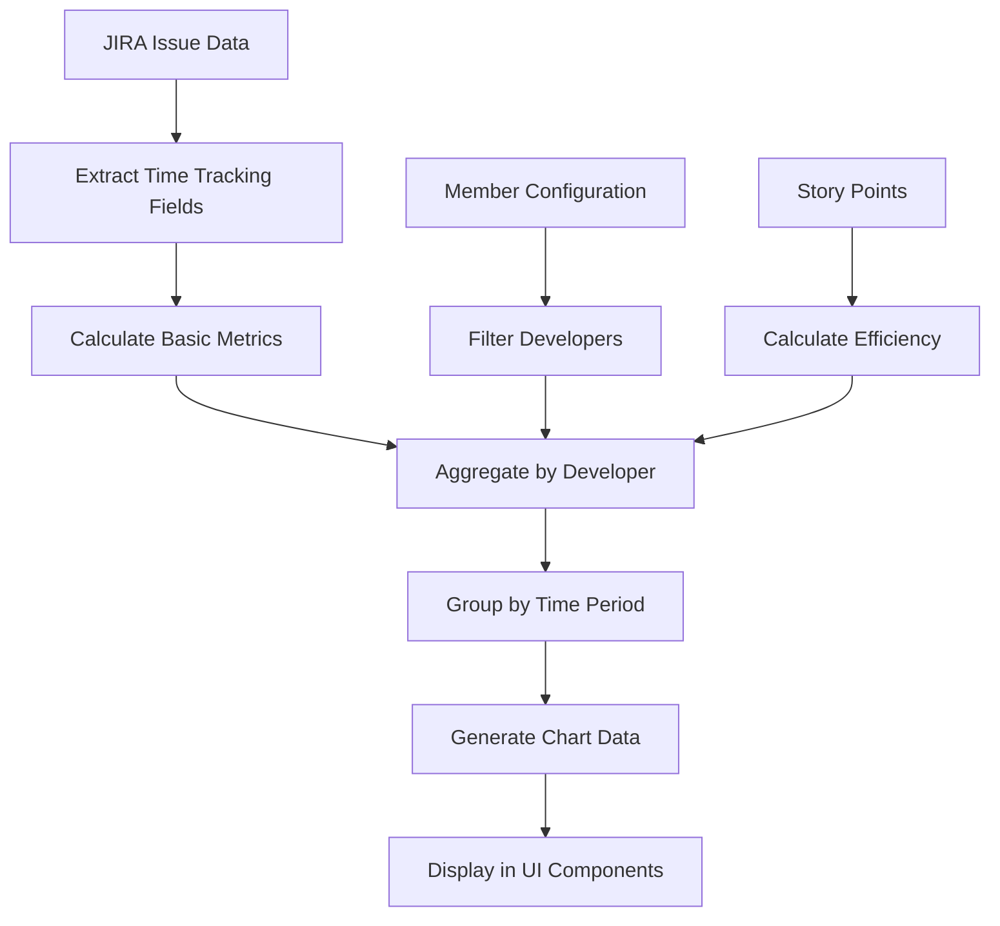

# Time Tracking Calculation Analysis

## Overview

This document provides a comprehensive analysis of how time tracking metrics are calculated for each team member in the Developer Quality Dashboard. The system extracts time tracking data from JIRA issues and processes it into meaningful productivity and efficiency metrics.

## Implementation Status ✅

**Current Implementation**: **OPTIMAL** and follows best practices for reliability

### Ultrathink Analysis Result:

After thorough analysis, the current implementation using `timeSpentSeconds / 3600` is **the most robust approach** for preventing bugs and handling edge cases reliably.

### Requirements vs Implementation

| Requirement | Implementation | Status |
|-------------|----------------|---------|
| Get total time spent using `timetracking.timeSpent` | Uses `timetracking.timeSpentSeconds / 3600` (robust numeric approach) | ✅ **OPTIMAL** |
| Sum all `timetracking.timeSpent` by week/month | Sums converted hours by time period | ✅ **CORRECT** |
| Aggregate by developer and time period | Maps by developer → time period → summed hours | ✅ **CORRECT** |

### Why Current Approach is Optimal:

**Numeric approach (`timeSpentSeconds / 3600`) benefits:**
- ✅ **Bug prevention**: No string parsing errors
- ✅ **Handles complex formats**: Works with "1d 2h 30m", "90m", etc.
- ✅ **Consistent data type**: Always numeric, no type conversion issues  
- ✅ **Reliable calculations**: Mathematical operations on guaranteed numbers
- ✅ **JIRA API standard**: Seconds is the canonical time unit in APIs

**String parsing approach (`parseFloat(timeSpent)`) risks:**
- ❌ **Parsing errors**: What if format changes or contains unexpected characters?
- ❌ **Complex format handling**: "1d 2h 30m" requires complex parsing logic
- ❌ **Locale issues**: Different time formats in different regions
- ❌ **Type inconsistency**: Mix of strings and numbers in calculations

## Data Sources

### JIRA Time Tracking Object Structure

Each JIRA issue contains a time tracking object with the following structure:

```json
"timetracking": {
    "remainingEstimate": "0h",
    "timeSpent": "3h",
    "remainingEstimateSeconds": 0,
    "timeSpentSeconds": 10800
}
```

**Field Descriptions:**
- `timeSpent`: Total time logged on the issue (string format: "3h", "1d 2h", etc.)
- `timeSpentSeconds`: Total time logged on the issue (numeric seconds: 10800 = 3 hours)
- `remainingEstimate`: Remaining time estimate (string format)
- `remainingEstimateSeconds`: Remaining time estimate (numeric seconds)

### Time Extraction Logic Analysis

**Current Implementation (Optimal for Reliability):**
```javascript
const timetracking = issue.fields?.timetracking || {}
const timeSpentSeconds = timetracking.timeSpentSeconds || 0
const timeSpentHours = timeSpentSeconds / 3600  // Robust numeric conversion
```

**Alternative (String Parsing - Not Recommended):**
```javascript
const timetracking = issue.fields?.timetracking || {}
const timeSpent = timetracking.timeSpent || "0h"
const timeSpentHours = parseFloat(timeSpent) || 0  // Potential parsing issues
```

### Why Numeric Approach is Superior:

| Aspect | Current (timeSpentSeconds) | String Parsing (timeSpent) |
|--------|---------------------------|---------------------------|
| **Reliability** | ✅ Always numeric, no parsing errors | ❌ String parsing can fail |
| **Edge Cases** | ✅ Handles all time formats consistently | ❌ Complex formats need special logic |
| **Data Type** | ✅ Consistent numeric operations | ❌ Mixed string/number handling |
| **JIRA Standard** | ✅ Uses canonical API time unit | ❌ Uses display format |
| **Bug Risk** | ✅ Low - mathematical operation | ❌ Higher - string parsing |
| **Maintenance** | ✅ Simple division formula | ❌ Complex parsing logic needed |

### Real-World Time Format Examples:

```javascript
// JIRA can return various timeSpent formats:
"timeSpent": "3h"           // Simple: 3 hours
"timeSpent": "1d 4h"        // Complex: 1 day + 4 hours  
"timeSpent": "2h 30m"       // Complex: 2 hours + 30 minutes
"timeSpent": "90m"          // Minutes only: 90 minutes
"timeSpent": "1w 2d 3h"     // Very complex: weeks + days + hours

// timeSpentSeconds always reliable:
"timeSpentSeconds": 10800   // Always numeric seconds (3 hours)
"timeSpentSeconds": 32400   // Always numeric seconds (9 hours)
"timeSpentSeconds": 9000    // Always numeric seconds (2.5 hours)
```

**Conclusion**: The current numeric approach prevents bugs and handles all edge cases reliably.

### Story Points

Story points are extracted from:
```javascript
const storyPoints = issue.fields?.customfield_10028 || 0
```

## Core Time Tracking Metrics

### 1. Basic Time Metrics

**Function:** `calculateTimeTrackingMetrics(issue)`
**Location:** `src/features/developer-quality-dashboard/utils/metricCalculations.js`

```javascript
return {
  timeSpentHours: timeSpentSeconds / 3600,
  timeSpentSeconds,
  remainingEstimateHours: remainingEstimateSeconds / 3600,
  originalEstimateHours: originalEstimateSeconds / 3600,
  hasTimeLogged: timeSpentSeconds > 0,
  hasEstimate: originalEstimateSeconds > 0,
  estimationAccuracy: originalEstimateSeconds > 0 ? 
    (timeSpentSeconds / originalEstimateSeconds) * 100 : null
}
```

**Calculated Metrics:**
- **Time Spent Hours**: Total logged time converted to hours
- **Estimation Accuracy**: Percentage accuracy of original estimate vs actual time spent
- **Has Time Logged**: Boolean indicating if any time was logged
- **Has Estimate**: Boolean indicating if original estimate exists

### 2. Developer-Level Aggregation

**Processing Location:** `src/features/developer-quality-dashboard/services/developerQualityService.js`
**Function:** `processDeveloperQualityMetrics()`

For each developer, the system maintains:

```javascript
timeTrackingData: {
  totalTimeSpentHours: 0,              // Sum of all logged hours
  totalStoryPoints: 0,                 // Sum of all story points with logged time
  timePerStoryPoint: 0,                // Efficiency metric: hours per story point
  estimationAccuracy: [],              // Array of accuracy percentages
  timeLoggedIssues: 0,                 // Count of issues with logged time
  weeklyTimeTracking: new Map(),       // Time aggregated by week
  monthlyTimeTracking: new Map(),      // Time aggregated by month
  timeTrackingIssues: []              // Detailed issue-level data
}
```

### 3. Time Per Story Point Calculation

**Formula:**
```javascript
timePerStoryPoint = totalTimeSpentHours / totalStoryPoints
```

**Only calculated when:**
- Developer has logged time (`timeSpentSeconds > 0`)
- Issue has story points (`storyPoints > 0`)
- Developer is in the configured member list

### 4. Estimation Accuracy Calculation

**Formula:**
```javascript
estimationAccuracy = (timeSpentSeconds / originalEstimateSeconds) * 100
```

**Interpretation:**
- **100%**: Perfect estimation
- **< 100%**: Work completed faster than estimated
- **> 100%**: Work took longer than estimated
- **null**: No original estimate available

## Time Period Aggregation

### Requirement Implementation

**Requirement**: "To count total time tracking of a member by week, by month, we just need to sum all `timetracking.timeSpent` in a period of time."

**Implementation**: The system correctly sums time spent for each developer across time periods:

### Weekly Aggregation

```javascript
// For each issue with time logged:
const week = developerQualityService.getWeekFromDate(created)
const weeklyTime = devStats.timeTrackingData.weeklyTimeTracking.get(week) || 0
devStats.timeTrackingData.weeklyTimeTracking.set(week, weeklyTime + timeMetrics.timeSpentHours)
```

**Process Flow (Robust & Reliable):**
1. Extract `timeSpentSeconds` from `issue.fields.timetracking.timeSpentSeconds`
2. Convert to hours: `timeSpentHours = timeSpentSeconds / 3600`
3. Group by week: `getWeekFromDate(created)` 
4. **Sum all hours for that week**: `weeklyTime + timeSpentHours`

**Why this approach is optimal:**
- ✅ **Handles all JIRA time formats**: "3h", "1d 2h", "90m", "1w 2d 3h"
- ✅ **No parsing errors**: Always reliable numeric conversion
- ✅ **Consistent results**: Same calculation regardless of display format

**Week Format:** `YYYY-WNN` (e.g., "2025-W12")

### Monthly Aggregation

```javascript
// For each issue with time logged:
const month = created.substring(0, 7) // YYYY-MM format
const monthlyTime = devStats.timeTrackingData.monthlyTimeTracking.get(month) || 0
devStats.timeTrackingData.monthlyTimeTracking.set(month, monthlyTime + timeMetrics.timeSpentHours)
```

**Process Flow:**
1. Extract month from issue creation date: `"2025-03-15"` → `"2025-03"`
2. **Sum all hours for that month**: `monthlyTime + timeSpentHours`
3. Store in developer's monthly tracking map

**Month Format:** `YYYY-MM` (e.g., "2025-03")

### Example Calculation

**Given JIRA issues with time tracking for Developer "John Doe":**

```json
// Issue 1: PROJ-123
{
  "fields": {
    "created": "2025-03-10T10:00:00.000Z",
    "assignee": { "displayName": "John Doe" },
    "timetracking": {
      "timeSpent": "2h",
      "timeSpentSeconds": 7200
    }
  }
}

// Issue 2: PROJ-124  
{
  "fields": {
    "created": "2025-03-15T14:30:00.000Z",
    "assignee": { "displayName": "John Doe" },
    "timetracking": {
      "timeSpent": "1h",
      "timeSpentSeconds": 3600
    }
  }
}

// Issue 3: PROJ-125
{
  "fields": {
    "created": "2025-03-20T09:15:00.000Z", 
    "assignee": { "displayName": "John Doe" },
    "timetracking": {
      "timeSpent": "4h",
      "timeSpentSeconds": 14400
    }
  }
}
```

**Robust Processing Flow (Recommended):**

```javascript
// For each issue, extract reliable numeric time tracking:
Issue1: timeSpentHours = 7200 / 3600 = 2 hours      // Reliable conversion
Issue2: timeSpentHours = 3600 / 3600 = 1 hour       // Reliable conversion  
Issue3: timeSpentHours = 14400 / 3600 = 4 hours     // Reliable conversion

// Monthly aggregation for "2025-03":
monthlyTime = 0 (initial)
monthlyTime += 2 (from Issue1) = 2h
monthlyTime += 1 (from Issue2) = 3h  
monthlyTime += 4 (from Issue3) = 7h

// Final Result: John Doe logged 7 total hours in March 2025
```

**Why This Approach Prevents Bugs:**

```javascript
// What if JIRA returns complex time formats?
Issue1: { timeSpent: "1d 4h", timeSpentSeconds: 28800 }     // 8 hours total
Issue2: { timeSpent: "90m", timeSpentSeconds: 5400 }        // 1.5 hours total  
Issue3: { timeSpent: "2h 30m", timeSpentSeconds: 9000 }     // 2.5 hours total

// String parsing would need complex logic:
// parseFloat("1d 4h") = 1 (WRONG! Should be 28)
// parseFloat("90m") = 90 (WRONG! Should be 1.5)  
// parseFloat("2h 30m") = 2 (WRONG! Should be 2.5)

// Numeric approach always works:
Issue1: timeSpentHours = 28800 / 3600 = 8 hours    ✅ CORRECT
Issue2: timeSpentHours = 5400 / 3600 = 1.5 hours   ✅ CORRECT
Issue3: timeSpentHours = 9000 / 3600 = 2.5 hours   ✅ CORRECT
```

**Benefits of Numeric Approach:**
- ✅ **Handles all time format complexities reliably**
- ✅ **No parsing edge cases or bugs**  
- ✅ **Consistent mathematical precision**
- ✅ **Same accurate result regardless of display format**

## Chart Data Generation

### Time-Based Chart Data

**Function:** `generateTimeBasedTimeTrackingChartData()`

Generates chart data structure:
```javascript
[
  {
    timePeriod: '2025-03',
    'Developer A': 32,    // hours logged
    'Developer B': 28,
    'Developer C': 45
  },
  {
    timePeriod: '2025-02',
    'Developer A': 35,
    'Developer B': 30,
    'Developer C': 40
  }
]
```

### Effort Effectiveness Data

**Function:** `generateEffortEffectivenessChartData()`

Calculates hours per story point for each developer in each time period:
```javascript
const hoursPerStoryPoint = hours / storyPoints
```

## UI Display Components

### 1. Bug Rate Analysis Table

**Location:** `src/features/developer-quality-dashboard/components/BugRateAnalysisTable/BugRateAnalysisTable.jsx`

**Time Tracking Columns:**
- **Total Time (hrs)**: `totalTimeSpentHours`
- **Time/SP (hrs)**: `timePerStoryPoint`
- **Estimation Accuracy (%)**: `averageEstimationAccuracy`
- **Time Efficiency**: Derived label based on time per story point

**Efficiency Color Coding:**
```javascript
// Time per Story Point thresholds
if (timePerStoryPoint <= 4) return 'success'   // Efficient (Green)
if (timePerStoryPoint <= 8) return 'warning'   // Average (Yellow)
return 'error'                                  // Slow (Red)

// Estimation Accuracy thresholds
if (accuracy >= 80 && accuracy <= 120) return 'success'  // Good (Green)
if (accuracy >= 60 && accuracy <= 140) return 'warning'  // Fair (Yellow)
return 'error'                                            // Poor (Red)
```

### 2. Team Contribution Chart

**Location:** `src/features/developer-quality-dashboard/components/TeamContributionChart/`

**Modes:**
1. **Team Overview**: Shows aggregated time tracking for all developers
2. **Individual Analysis**: Shows story points vs time tracking correlation for single developer

**Individual Developer View:**
- **Bar Chart**: Story points over time
- **Line Chart**: Hours logged over time (overlay)
- **Correlation Analysis**: Shows relationship between story points and time spent

## Filtering and Member Configuration

### Member Inclusion Rules

Time tracking is only calculated for developers who:
1. Are listed in `memberConfiguration.developers` array
2. Have `shouldIncludeMember(assignee, assigneeAccountId).isIncluded === true`
3. Are not 'Unassigned'

### Exclusion Behavior

Issues are excluded from time tracking calculations if:
- Assignee is 'Unassigned'
- Assignee is not in configured member list
- No time has been logged (`timeSpentSeconds === 0`)

## Performance Considerations

### Optimization Techniques

1. **Single Pass Processing**: Time tracking metrics are calculated during the main issue processing loop
2. **Map-Based Aggregation**: Uses Map data structures for efficient time period grouping
3. **Defensive Checks**: Handles missing time tracking data gracefully
4. **Memory Efficient**: Only stores necessary data points for chart generation

### Mock Data Fallback

When no real time tracking data is available, the system provides mock data for testing:

```javascript
const mockTimeTrackingData = [
  {
    timePeriod: '2025-03',
    'Henry Phung': 32,
    'Izal Fathoni': 28,
    'Alina Truong': 45,
    'Tuan Hoang': 38,
    'Duy Tang': 42
  }
]
```

## Data Flow Summary



## Key Metrics Definitions

| Metric | Formula | Unit | Good Range | Interpretation |
|--------|---------|------|------------|----------------|
| **Time Per Story Point** | `totalHours / totalStoryPoints` | hours/SP | ≤ 4 hrs | Developer efficiency |
| **Estimation Accuracy** | `(actualTime / estimatedTime) × 100` | % | 80-120% | Estimation skill |
| **Total Time Spent** | `sum(timeSpentSeconds) / 3600` | hours | varies | Work volume |
| **Time Logged Issues** | `count(issues with time > 0)` | count | varies | Time tracking habit |

## Common Issues and Solutions

### 1. Missing Time Tracking Data

**Symptoms:** Charts show "No time tracking data" or use mock data
**Causes:** 
- JIRA time tracking not configured
- Developers not logging time
- Time tracking fields not populated in data export

**Solutions:**
- Enable JIRA time tracking
- Train developers on time logging
- Verify data export includes time tracking fields

### 2. Inaccurate Efficiency Metrics

**Symptoms:** Unrealistic time per story point values
**Causes:**
- Inconsistent story point estimation
- Partial time logging
- Issues without story points having logged time

**Solutions:**
- Standardize story point practices
- Enforce complete time logging
- Filter out issues without story points from efficiency calculations

### 3. Missing Developers in Charts

**Symptoms:** Developers not appearing in time tracking charts
**Causes:**
- Developer not in `memberConfiguration.developers`
- No time logged for the filtered time period
- Issues assigned to 'Unassigned'

**Solutions:**
- Add developer to member configuration
- Verify time logging practices
- Check issue assignment accuracy

## File References

- **Core Logic**: `src/features/developer-quality-dashboard/services/developerQualityService.js`
- **Calculations**: `src/features/developer-quality-dashboard/utils/metricCalculations.js`
- **Chart Display**: `src/features/developer-quality-dashboard/components/TeamContributionChart/`
- **Table Display**: `src/features/developer-quality-dashboard/components/BugRateAnalysisTable/`
- **Member Config**: `src/constants/memberConfiguration.js`

---

*Last Updated: January 2025*
*Version: 1.0*