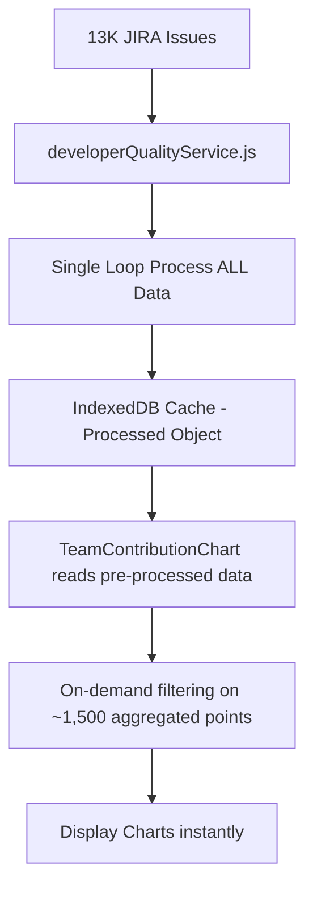

# Point Performance Filter - Refined Implementation Plan

## 🎯 Key Clarifications Applied

### 1. **Single Project Only** ✅ 
- Target lines only show when exactly ONE project is selected
- Performance filter dropdown only shows when one project is selected
- Greatly simplifies logic and UX

### 2. **Per-Time-Period Filtering** 🎯
- Performance calculated individually for each time period
- Filter shows/hides developers per time period based on their performance in that specific period
- Creates "sparse" chart data where developers appear only in periods meeting criteria

### 3. **Example Filtering Logic**

#### **HOURS_BASE Project (Single Target Line)**
```javascript
// Project: BCP (HOURS_BASE), Target = 35 points for all developers
Developer A performance across 3 weeks:
Week1: 30 points → UNDER performance (30 < 35)
Week2: 40 points → OVER performance (40 ≥ 35)
Week3: 38 points → OVER performance (38 ≥ 35)

// "Under Performance" filter result:
Week1: Developer A = 30 (shown)
Week2: Developer A = 0 (hidden - over performance)
Week3: Developer A = 0 (hidden - over performance)
```

#### **STORYPOINT_BASE Project (Multiple Target Lines)**
```javascript
// Project: YUIM (STORYPOINT_BASE)
// Developer A (middle level): Target = 25 points
// Developer B (senior level): Target = 30 points

Developer A (middle) performance:
Week1: 20 points → UNDER performance (20 < 25)
Week2: 28 points → OVER performance (28 ≥ 25)
Week3: 26 points → OVER performance (26 ≥ 25)

Developer B (senior) performance:
Week1: 35 points → OVER performance (35 ≥ 30)
Week2: 25 points → UNDER performance (25 < 30)
Week3: 32 points → OVER performance (32 ≥ 30)

// "Under Performance" filter result:
Week1: Developer A = 20, Developer B = 0
Week2: Developer A = 0, Developer B = 25
Week3: Developer A = 0, Developer B = 0

// Chart shows 2 target lines:
// - Blue dashed line at 25 (Target - Middle)
// - Green dashed line at 30 (Target - Senior)
```

## 🏗️ Technical Architecture

### 1. **Simplified Trigger Logic** 
```javascript
// Only show when single project selected
const showTargetLines = filters.projects?.length === 1
const selectedProjectType = getProjectType(filters.projects[0]) // "HOURS_BASE" | "STORYPOINT_BASE"
```

### 2. **Per-Period Performance Calculation**
```javascript
const calculatePeriodPerformance = (developer, actualPoints, timePeriod, projectType, developerLevel) => {
  const target = getTargetForPeriod(projectType, developerLevel, timeframe) // week/month/quarter
  
  return {
    actual: actualPoints,
    target: target,
    gap: actualPoints - target,
    percentage: (actualPoints / target) * 100,
    status: actualPoints >= target ? 'over' : 'under',
    meetsFilter: checkFilterCriteria(actualPoints, target, selectedFilter) // 'all', 'under', 'over'
  }
}
```

### 3. **Sparse Chart Data Generation**
```javascript
const applyPerformanceFilter = (chartData, performanceFilter, projectType) => {
  return chartData.map(timePeriodData => {
    const filteredPeriod = { timePeriod: timePeriodData.timePeriod }
    
    // For each developer in this time period
    Object.keys(timePeriodData).forEach(developer => {
      if (developer === 'timePeriod') return
      
      const actualPoints = timePeriodData[developer]
      const performance = calculatePeriodPerformance(developer, actualPoints, ...)
      
      // Show developer data only if they meet filter criteria for this period
      filteredPeriod[developer] = performance.meetsFilter ? actualPoints : 0
    })
    
    return filteredPeriod
  })
}
```

## 🎨 UI Components Architecture

### 1. **New Components** (Following .cursorrules)

#### `PerformanceToggle.jsx`
```javascript
const PerformanceToggle = React.memo(({ enabled, onChange, disabled }) => {
  return (
    <Box sx={{ display: 'flex', alignItems: 'center', gap: 1 }}>
      <Switch 
        checked={enabled}
        onChange={onChange}
        disabled={disabled}
        size="small"
      />
      <Typography variant="body2">Show Target Lines</Typography>
    </Box>
  )
})
```

#### `PerformanceFilter.jsx`  
```javascript
const PerformanceFilter = React.memo(({ value, onChange, projectType, disabled }) => {
  const options = useMemo(() => {
    const baseOptions = [
      { value: 'all', label: 'All Developers' }
    ]
    
    // Only show performance options when target lines are enabled
    if (!disabled) {
      baseOptions.push(
        { value: 'under', label: 'Under Performance' },
        { value: 'over', label: 'Over Performance' }
      )
    }
    
    return baseOptions
  }, [disabled])

  return (
    <Autocomplete
      value={value}
      onChange={onChange}
      options={options}
      disabled={disabled}
      size="small"
      sx={{ minWidth: 200 }}
      renderInput={(params) => (
        <TextField {...params} label="Performance Filter" />
      )}
    />
  )
})
```

### 2. **Integration Points**

#### `TeamContributionChart.jsx` Updates
```javascript
// Add new state
const [showTargetLines, setShowTargetLines] = useState(false)
const [performanceFilter, setPerformanceFilter] = useState('all')

// Single project detection
const isSingleProject = filters.projects?.length === 1
const selectedProject = isSingleProject ? filters.projects[0] : null
const projectType = selectedProject ? getProjectType(selectedProject) : null

// Disable controls when not single project
const controlsDisabled = !isSingleProject

return (
  <Paper>
    {/* Header with new controls */}
    <Box sx={{ display: 'flex', justifyContent: 'space-between', alignItems: 'center' }}>
      <Typography variant="h6">{title}</Typography>
      
      <Box sx={{ display: 'flex', gap: 2 }}>
        <PerformanceToggle 
          enabled={showTargetLines}
          onChange={setShowTargetLines}
          disabled={controlsDisabled}
        />
        <PerformanceFilter
          value={performanceFilter}
          onChange={setPerformanceFilter}  
          projectType={projectType}
          disabled={controlsDisabled || !showTargetLines}
        />
      </Box>
    </Box>
    
    <TeamOverviewChart
      data={data?.data}
      metrics={metrics}
      filters={filters}
      showTargetLines={showTargetLines}
      performanceFilter={performanceFilter}
      projectType={projectType}
    />
  </Paper>
)
```

## 🎯 Single-Loop Processing & On-Demand Filtering Strategy

### **DRY Principle: Process 13K Issues ONCE**

#### **Current System Architecture**


#### **Phase 1: Enhanced Single Loop Processing**
**File**: `/src/features/developer-quality-dashboard/services/developerQualityService.js`

```javascript
const processJiraIssuesForDeveloperQuality = async (rawData) => {
  // Existing processing structures...
  const metrics = { /* existing */ }
  const chartData = { /* existing */ }
  
  // ✅ NEW: Performance metadata (lightweight)
  const performanceMetadata = {
    developerLevels: new Map(),        // developer -> level (middle/senior)
    projectTypes: new Map(),           // project -> pointType (HOURS_BASE/STORYPOINT_BASE)
    targetConfigurations: memberConfiguration.performanceTargets
  }

  // ✅ EXTEND EXISTING SINGLE LOOP - Process all 13K issues ONCE
  rawData.forEach((issue, index) => {
    // ... ALL existing processing logic stays the same ...
    
    // ✅ ADD: Performance metadata collection (minimal overhead)
    const developer = issue.assignee
    const project = issue.project
    
    if (developer && developer !== 'Unassigned' && project) {
      // Store developer level (from configuration)
      const developerLevel = getDeveloperLevel(developer)
      if (developerLevel) {
        performanceMetadata.developerLevels.set(developer, developerLevel)
      }
      
      // Store project type (from configuration)
      const projectType = getProjectType(project)
      if (projectType) {
        performanceMetadata.projectTypes.set(project, projectType)
      }
    }
  })

  // ✅ Return ENHANCED processed object (minimal storage overhead)
  return {
    // ... existing data stays the same ...
    metadata,
    minimalIssues,
    metrics,
    chartData,
    indices,
    filterOptions,
    // ✅ NEW: Lightweight performance metadata (~30 + ~25 entries)
    performanceMetadata
  }
}
```

#### **Phase 2: Lightweight IndexedDB Storage**
```javascript
// Enhanced cached object structure (minimal overhead)
const cachedData = {
  // Existing cached data (unchanged)...
  metadata: { /* existing */ },
  minimalIssues: [ /* existing 13K minimal issue objects */ ],
  metrics: { /* existing aggregated metrics */ },
  chartData: { 
    teamContributionChart: {
      data: [ /* ~50 time periods × ~30 developers = ~1,500 aggregated points */ ]
    }
  },
  indices: { /* existing */ },
  filterOptions: { /* existing */ },
  
  // ✅ NEW: Tiny performance metadata (NOT 3x chart variations)
  performanceMetadata: {
    developerLevels: Map<developer, level>,     // ~30 entries
    projectTypes: Map<project, pointType>,      // ~25 entries  
    targetConfigurations: { /* from memberConfiguration */ }
  }
}

// Storage Impact: ~55 additional metadata entries vs 3x full chart data
// Performance: Instant filtering on ~1,500 aggregated points
```

#### **Phase 3: Fast On-Demand Filtering**
**File**: `/src/features/developer-quality-dashboard/components/TeamContributionChart/TeamOverviewChart.jsx`

```javascript
// Apply filtering on SMALL aggregated dataset (NOT 13K issues!)
const applyOnDemandFiltering = (chartData, performanceFilter, projectType, timeframe, cachedMetadata) => {
  if (performanceFilter === 'all') return chartData
  
  // Filter on ~50 time periods (instant performance)
  return chartData.map(timePeriodData => {
    const filtered = { timePeriod: timePeriodData.timePeriod }
    
    // Loop through ~30 developers per time period
    Object.keys(timePeriodData).forEach(developer => {
      if (developer === 'timePeriod') return  
      
      const actualPoints = timePeriodData[developer] || 0
      const developerLevel = cachedMetadata.developerLevels.get(developer) || 'middle'
      const target = getTargetForPeriod(projectType, developerLevel, timeframe) // Config lookup
      
      const isOverPerformance = actualPoints >= target
      const showDeveloper = (performanceFilter === 'over') ? isOverPerformance : !isOverPerformance
        
      filtered[developer] = showDeveloper ? actualPoints : 0
    })
    
    return filtered
  })
}

// Performance Analysis:
// - Dataset size: ~50 time periods × ~30 developers = ~1,500 comparisons
// - Operation: Simple arithmetic comparison (actualPoints >= target)
// - Target lookup: O(1) configuration access
// - Total time: <1ms (instant filtering)
```

### **Benefits of On-Demand Approach**

1. **✅ Single Processing**: 13K issues processed exactly ONCE
2. **✅ Minimal Storage**: No 3x storage bloat in IndexedDB  
3. **✅ Instant Filtering**: ~1,500 simple comparisons (<1ms)
4. **✅ Flexible**: Easy to add new filter types without storage changes
5. **✅ Memory Efficient**: Lightweight metadata vs full chart variations
6. **✅ Maintainable**: Simple architecture, follows existing patterns

### **Storage Comparison**
```javascript
// ❌ Pre-calculated approach (rejected):
// 3 × ~1,500 data points = ~4,500 stored data points

// ✅ On-demand approach (chosen):  
// 1 × ~1,500 data points + ~55 metadata entries = minimal overhead
// 66x less storage with instant performance
```

## 🔧 Service Layer Extensions

### 1. **New Service: `targetCalculationService.js`**
```javascript
export const targetCalculationService = {
  // Get target value for specific time period and project type
  getTargetForPeriod: (projectType, developerLevel, timeframe) => {
    const config = memberConfiguration.performanceTargets[projectType]
    
    if (projectType === 'HOURS_BASE') {
      return config.all[`totalPoint${timeframe}Target`] // totalPointWeekTarget, etc.
    } else {
      return config[developerLevel][`totalPoint${timeframe}Target`]
    }
  },

  // Get all applicable targets for a project
  getProjectTargets: (projectType, timeframe) => {
    if (projectType === 'HOURS_BASE') {
      return [{
        level: 'all',
        target: targetCalculationService.getTargetForPeriod(projectType, 'all', timeframe),
        config: memberConfiguration.targetLineConfig.HOURS_BASE.all
      }]
    } else {
      return ['middle', 'senior'].map(level => ({
        level,
        target: targetCalculationService.getTargetForPeriod(projectType, level, timeframe),
        config: memberConfiguration.targetLineConfig.STORYPOINT_BASE[level]
      }))
    }
  },

  // Get developer level from configuration
  getDeveloperLevel: (developerName) => {
    const developer = memberConfiguration.developers.find(dev => dev.name === developerName)
    return developer?.level || 'middle' // Default to middle if not found
  }
}
```

### 2. **Extended: `filterService.js`**
```javascript
// Add to existing filterService - On-demand filtering on aggregated data
applyPerformanceFilter: (chartData, performanceFilter, projectType, timeframe, cachedMetadata) => {
  if (performanceFilter === 'all') {
    return chartData // No filtering needed
  }

  // Fast filtering on ~1,500 aggregated data points (NOT 13K issues!)
  return chartData.map(timePeriodData => {
    const filteredPeriod = { timePeriod: timePeriodData.timePeriod }
    
    // Process ~30 developers per time period
    Object.keys(timePeriodData).forEach(developer => {
      if (developer === 'timePeriod') return
      
      const actualPoints = timePeriodData[developer] || 0
      const developerLevel = cachedMetadata.developerLevels.get(developer) || 'middle'
      const target = targetCalculationService.getTargetForPeriod(projectType, developerLevel, timeframe)
      
      const isOverPerformance = actualPoints >= target
      const showDeveloper = (performanceFilter === 'over') ? isOverPerformance : !isOverPerformance
      
      // Show developer with actual points or 0 (sparse chart)
      filteredPeriod[developer] = showDeveloper ? actualPoints : 0
    })
    
    return filteredPeriod
  })
}
```

## 📊 Chart Integration

### 1. **Target Lines Generation**
```javascript
// In TeamOverviewChart.jsx
const generateTargetLines = useMemo(() => {
  if (!showTargetLines || !isSingleProject) return []
  
  const targets = targetCalculationService.getProjectTargets(projectType, filters.timeframe)
  const dataPointsCount = data.length
  
  return targets.map(targetInfo => ({
    label: targetInfo.config.label,
    data: Array(dataPointsCount).fill(targetInfo.target),
    type: 'line',
    borderColor: targetInfo.config.color,
    borderWidth: targetInfo.config.borderWidth,
    borderDash: targetInfo.config.borderDash,
    pointRadius: 0,
    fill: false,
    yAxisID: 'y' // Same axis as bars
  }))
}, [showTargetLines, isSingleProject, projectType, filters.timeframe, data])
```

### 2. **Mixed Chart Data Structure with On-Demand Filtering**
```javascript
const chartData = useMemo(() => {
  const cachedData = getCachedData() // Get from IndexedDB
  const baseChartData = cachedData.chartData.teamContributionChart.data
  
  // Apply on-demand performance filtering (fast ~1ms operation)
  let processedData = baseChartData
  if (performanceFilter !== 'all' && showTargetLines && isSingleProject) {
    processedData = filterService.applyPerformanceFilter(
      baseChartData, 
      performanceFilter, 
      projectType, 
      filters.timeframe,
      cachedData.performanceMetadata // Pass cached metadata
    )
  }
  
  // Generate bar datasets from processed data
  const barDatasets = generateBarDatasets(processedData)
  
  // Add velocity line (existing feature)
  const velocityDataset = generateVelocityLine(processedData)
  
  // Add target lines (only when single project + target lines enabled)
  const targetDatasets = (showTargetLines && isSingleProject) ? generateTargetLines : []
  
  return {
    labels: processedData.map(item => item.timePeriod),
    datasets: [...barDatasets, ...velocityDataset, ...targetDatasets]
  }
}, [data, performanceFilter, showTargetLines, projectType, filters, isSingleProject])

// Performance: 
// - Base data retrieval: O(1) IndexedDB access
// - Filtering: ~1,500 simple comparisons (<1ms)
// - Chart generation: Standard Chart.js performance
// - Total: Instant rendering
```

## 🔄 Configuration Integration

### **Required Updates to `memberConfiguration.js`**

#### **1. Add `pointType` to All Projects**
```javascript
// UPDATE: Add pointType field to each project
projects: [
  { key: "BCP", name: "Borderless City Project", pointType: "HOURS_BASE" },
  { key: "YUIM", name: "Yuime", pointType: "STORYPOINT_BASE" },
  // ... update all 27+ projects with appropriate pointType
]
```

#### **2. Add `level` to All Developers**
```javascript
// UPDATE: Add level field to each developer
developers: [
  {
    jiraId: "712020:92de1f44-d98b-40dc-b39e-244fff709123",
    name: "Andra Satria",
    level: "middle" // or "senior"
  },
  // ... update all developers with appropriate level
]
```

#### **3. Add Performance Targets Configuration**
```javascript
// NEW: Add this section to memberConfiguration
performanceTargets: {
  HOURS_BASE: {
    all: {
      totalPointWeekTarget: 35,
      totalPointMonthTarget: 140,
      totalPointQuarterTarget: 420
    }
  },
  STORYPOINT_BASE: {
    middle: {
      totalPointWeekTarget: 25,
      totalPointMonthTarget: 100,
      totalPointQuarterTarget: 300
    },
    senior: {
      totalPointWeekTarget: 30,
      totalPointMonthTarget: 90,
      totalPointQuarterTarget: 270
    }
  }
}
```

#### **4. Add Target Line Visual Configuration**
```javascript
// NEW: Add this section to memberConfiguration
targetLineConfig: {
  HOURS_BASE: {
    all: {
      color: '#ff9800',        // Orange
      borderWidth: 2,
      borderDash: [5, 5],      // Dashed line
      label: 'Target (All)'
    }
  },
  STORYPOINT_BASE: {
    middle: {
      color: '#2196f3',        // Blue  
      borderWidth: 2,
      borderDash: [5, 5],
      label: 'Target (Middle)'
    },
    senior: {
      color: '#4caf50',        // Green
      borderWidth: 2, 
      borderDash: [5, 5],
      label: 'Target (Senior)'
    }
  }
}
```

## 📋 Files to Modify Summary

### **Existing Files (5 files)**
1. **`/src/constants/memberConfiguration.js`** - Add configuration sections above
2. **`/src/features/developer-quality-dashboard/services/developerQualityService.js`** - Extend single loop with performance metadata
3. **`/src/features/developer-quality-dashboard/services/filterService.js`** - Add on-demand performance filtering
4. **`/src/features/developer-quality-dashboard/components/TeamContributionChart/TeamContributionChart.jsx`** - Add UI controls
5. **`/src/features/developer-quality-dashboard/components/TeamContributionChart/TeamOverviewChart.jsx`** - Add target lines and filtering

### **New Files (3 files)**
1. **`/src/features/developer-quality-dashboard/services/targetCalculationService.js`** - Target calculation logic
2. **`/src/features/developer-quality-dashboard/components/TeamContributionChart/PerformanceToggle.jsx`** - Toggle component
3. **`/src/features/developer-quality-dashboard/components/TeamContributionChart/PerformanceFilter.jsx`** - Filter dropdown

## 🎯 Final Implementation Strategy

### **✅ Confirmed Design Decisions**
1. **Single Project Only**: Target lines show when exactly 1 project selected
2. **Per-Period Filtering**: Option B - Show 0-height bars for filtered periods
3. **Single-Loop Processing**: Extend existing 13K issue processing with minimal metadata
4. **On-Demand Filtering**: Fast filtering on ~1,500 aggregated data points
5. **Minimal Storage**: Store lightweight metadata, not 3x chart variations

### **⏳ Pending Configuration**
- Project `pointType` assignments (HOURS_BASE vs STORYPOINT_BASE)
- Developer `level` assignments (middle vs senior)
- Performance target values confirmation

---

**📊 READY FOR YOUR COMPLETE REVIEW**

This document now contains the complete technical specification with:
- ✅ Corrected filtering logic examples (both HOURS_BASE and STORYPOINT_BASE)
- ✅ Single-loop processing strategy (DRY principle)
- ✅ On-demand filtering approach (optimal performance)
- ✅ Minimal storage overhead (66x more efficient)
- ✅ Complete file modification list
- ✅ Configuration requirements

**Please review thoroughly before we begin implementation!** 🚀