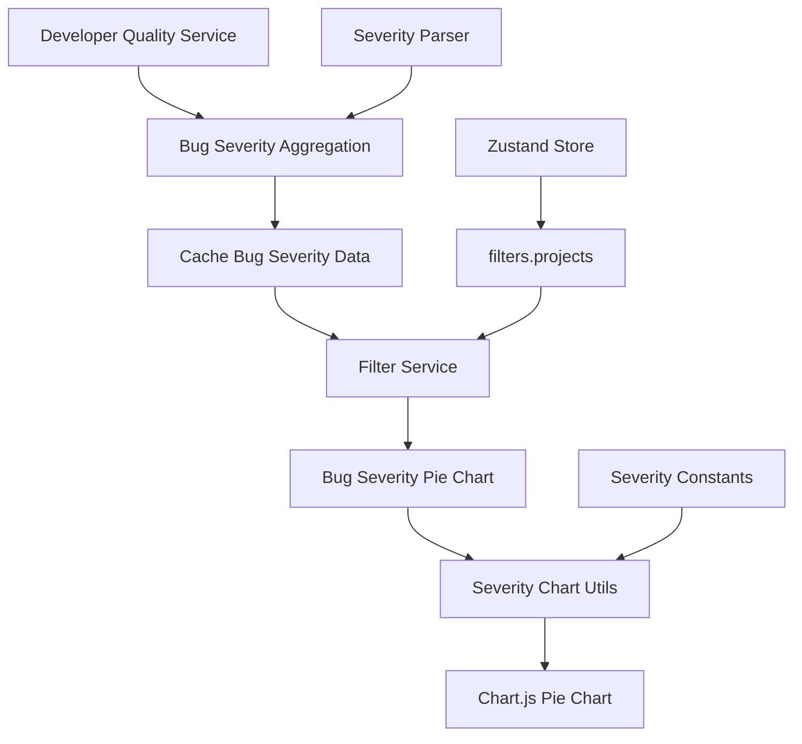

# Bug Severity Pie Chart Implementation Plan

## 1. Overview

This document outlines the implementation plan for a new **Bug Severity Pie Chart** component that will display the distribution of bug severities within selected projects. The component will integrate seamlessly with the existing Developer Quality Dashboard architecture.

## 2. Requirements Analysis

### 2.1 Core Requirements
- **Display**: Pie chart showing bug severity distribution (Critical, Major, Minor, Low, Cosmetic, Unknown)
- **Data Source**: Filtered by `Filters.projects` from zustand state only
- **Integration**: Follow the data flow pattern established by `BugStatusChart`
- **Severity Logic**: Use existing severity parsing from `BugRateAnalysisTable`
- **Architecture**: Inherit current flow without breaking existing functionality

### 2.2 Data Dependencies
- **Filters**: `filters.projects` array from zustand state
- **Severity Parsing**: Centralized severity parsing from `src/shared/utils/severityParser.js`
- **Constants**: Severity levels and UI mapping from `src/shared/constants/severityConstants.js`
- **Data Processing**: Integration with existing data processing pipeline

## 3. Current Architecture Analysis

### 3.1 BugStatusChart Data Flow Pattern
```javascript
// Data Flow: BugStatusChart.jsx
1. Receives `data` prop with structured chart data
2. Uses `useDeveloperQualityFilters` hook for filter access
3. Transforms data using utility functions from `bugStatusChartUtils.js`
4. Applies project filtering during data transformation
5. Renders using react-chartjs-2 with Chart.js configuration

// Data Structure Received:
{
  data: {
    aggregated: Object,     // Aggregated data across all projects
    byProject: Object,      // Data grouped by project
    metadata: Object        // Processing metadata
  },
  config: {
    timePeriod: string,     // 'week', 'month', 'quarter'
    periodKey: string       // Time period key
  }
}
```

### 3.2 Severity Logic from BugRateAnalysisTable
```javascript
// Severity Processing Logic:
1. Uses centralized parseSeverity() from severityParser.js
2. Builds severityBreakdown object per developer: 
   { Critical: 2, Major: 5, Minor: 1, Low: 0, Cosmetic: 0, Unknown: 1 }
3. Renders severity chips with counts in table columns
4. Filters out zero-count severities for display

// Current Severity Constants:
SEVERITY_LEVELS = ['Critical', 'Major', 'Minor', 'Low', 'Cosmetic', 'Unknown']
DEFAULT_SEVERITY_WEIGHTS = { Critical: 1.0, Major: 0.7, Minor: 0.5, Low: 0.3, Cosmetic: 0.1, Unknown: 0.2 }
SEVERITY_UI_MAPPING = { Critical: 'error', Major: 'warning', Minor: 'info', Low: 'success', ... }
```

### 3.3 Project Filtering Architecture
```javascript
// Project Filter Structure:
filters.projects = ['ProjectA', 'ProjectB'] // Array of project names from zustand

// Filter Application:
1. useDeveloperQualityFilters hook provides filters
2. Special handling for projects to ensure reference changes
3. Filter indices applied during data processing
4. Project-specific data aggregation in services
```

## 4. Implementation Strategy

### 4.1 Data Flow Architecture
Following the established pattern:



### 4.2 Component Structure
```
src/features/developer-quality-dashboard/components/BugSeverityChart/
├── BugSeverityChart.jsx       # Main component
├── index.js                   # Export
└── __tests__/
    └── BugSeverityChart.test.jsx
```

### 4.3 Utility Integration
```
src/features/developer-quality-dashboard/utils/
├── bugSeverityChartUtils.js   # New utility file
└── index.js                   # Updated exports
```

## 5. Data Structure Design

### 5.1 Cache Data Structure
Extend existing cache with bug severity aggregation:

```javascript
// NEW: Add to developerQualityService.js processJiraIssuesForDeveloperQuality()
chartData: {
  // ... existing charts
  bugSeverityChart: {
    type: 'pie',
    data: {
      aggregated: {
        severityDistribution: {
          Critical: 15,
          Major: 28,
          Minor: 45,
          Low: 12,
          Cosmetic: 3,
          Unknown: 7
        },
        totalBugCount: 110,
        mostCommonSeverity: 'Minor',
        weightedScore: 67.4
      },
      byProject: {
        'ProjectA': {
          severityDistribution: { Critical: 8, Major: 15, Minor: 20, Low: 5, Cosmetic: 1, Unknown: 2 },
          totalBugCount: 51,
          projectKey: 'PROJA',
          projectName: 'ProjectA'
        },
        'ProjectB': {
          severityDistribution: { Critical: 7, Major: 13, Minor: 25, Low: 7, Cosmetic: 2, Unknown: 5 },
          totalBugCount: 59,
          projectKey: 'PROJB', 
          projectName: 'ProjectB'
        }
      },
      metadata: {
        totalProjects: 2,
        processingTimestamp: '2024-01-15T10:30:00.000Z',
        severityParsingStats: {
          totalIssues: 110,
          successfulParses: 103,
          fallbackUsed: 15,
          unknownSeverities: 7,
          successRate: 93.6
        }
      }
    },
    config: {
      showLegend: true,
      colorScheme: 'severity',
      responsive: true,
      filterBy: 'projects' // Only project filtering supported
    }
  }
}
```

### 5.2 Filtered Data Structure
After filter application:

```javascript
// Filter Response Structure for BugSeverityChart
filteredChartData: {
  bugSeverityChart: {
    data: {
      aggregated: {
        // Aggregated data for selected projects only
        severityDistribution: { Critical: 8, Major: 15, Minor: 20, Low: 5, Cosmetic: 1, Unknown: 2 },
        totalBugCount: 51,
        mostCommonSeverity: 'Minor',
        weightedScore: 35.2
      },
      byProject: {
        'SelectedProject': { ... } // Only selected projects
      },
      metadata: {
        selectedProjects: ['ProjectA'],
        filteredBugCount: 51,
        appliedFilters: { projects: ['ProjectA'] }
      }
    }
  }
}
```

## 6. Chart Configuration

### 6.1 Chart.js Pie Chart Configuration
```javascript
// Bug Severity Chart Configuration
const pieChartConfig = {
  responsive: true,
  maintainAspectRatio: false,
  plugins: {
    legend: {
      position: 'right',
      labels: {
        usePointStyle: true,
        generateLabels: (chart) => {
          // Custom label generation with counts and percentages
        }
      }
    },
    tooltip: {
      callbacks: {
        label: (context) => {
          const severity = context.label
          const count = context.parsed
          const percentage = ((count / total) * 100).toFixed(1)
          const weight = getSeverityWeight(severity)
          return `${severity}: ${count} bugs (${percentage}%) - Weight: ${weight}`
        }
      }
    }
  },
  onClick: (event, activeElements) => {
    // Future enhancement: Could filter by severity
  }
}
```

### 6.2 Color Scheme
```javascript
// Severity Color Mapping (from severityConstants.js)
const severityColors = {
  Critical: '#d32f2f',    // Error red
  Major: '#ff9800',       // Warning orange  
  Minor: '#1976d2',       // Info blue
  Low: '#2e7d32',         // Success green
  Cosmetic: '#757575',    // Default grey
  Unknown: '#9e9e9e'      // Light grey
}
```

## 7. Processing Logic

### 7.1 Reuse Existing Severity Data ✅
**You're absolutely right!** The severity aggregation logic already exists in:

- **`developerQualityService.js`** (line 453-459): `bugAnalysis.severityDistribution`
- **`developerQualityService.js`** (line 812-820): Per-developer `severityBreakdown` calculation  
- **`bugRateAnalysis.developers`** (line 1164): Stored `severityBreakdown` per developer

```javascript
// EXISTING DATA STRUCTURE (Already Available):
metrics.bugRateAnalysis.developers = [
  {
    developer: 'John Doe',
    severityBreakdown: { Critical: 2, Major: 5, Minor: 1, Low: 0, Cosmetic: 0, Unknown: 1 },
    projects: ['ProjectA', 'ProjectB'],
    // ... other fields
  }
]

// EXISTING GLOBAL SEVERITY DISTRIBUTION:
metrics.bugAnalysis.severityDistribution = {
  Critical: 15, Major: 28, Minor: 45, Low: 12, Unknown: 7
}
```

**Instead of creating new aggregation logic, we'll:**
1. **Aggregate existing `severityBreakdown`** from filtered developers
2. **Filter by project** using existing developer project associations  
3. **Transform to pie chart format** using utility functions

### 7.2 Filter Integration Logic (Simplified)
```javascript
// UPDATED: Use existing bug rate analysis data
const aggregateSeverityFromDevelopers = (filteredData, filters) => {
  const severityDistribution = initializeSeverityBreakdown()
  let totalBugCount = 0

  // Get developers from filtered bug rate analysis data
  const developers = filteredData.filteredMetrics?.bugRateAnalysis?.developers || []
  
  // Apply project filter if specified
  const filteredProjects = filters.projects || []
  
  developers.forEach(developer => {
    // Filter by project if specified
    if (filteredProjects.length > 0) {
      // Check if developer worked on any of the selected projects
      const hasMatchingProjects = developer.projects?.some(project => 
        filteredProjects.includes(project)
      )
      if (!hasMatchingProjects) return
    }

    // Aggregate severity breakdown from this developer
    if (developer.severityBreakdown) {
      Object.entries(developer.severityBreakdown).forEach(([severity, count]) => {
        severityDistribution[severity] = (severityDistribution[severity] || 0) + count
        totalBugCount += count
      })
    }
  })

  return {
    data: {
      aggregated: {
        severityDistribution,
        totalBugCount,
        mostCommonSeverity: findMostCommonSeverity(severityDistribution),
        weightedScore: calculateWeightedSeverityScore(severityDistribution)
      },
      metadata: {
        selectedProjects: filteredProjects,
        filteredBugCount: totalBugCount,
        developerCount: developers.length
      }
    }
  }
}
```

## 8. Component Implementation

### 8.1 BugSeverityChart Component Structure
```javascript
// BugSeverityChart.jsx
const BugSeverityChart = React.memo(({
  data,
  filters,
  height = 400,
  title = 'Bug Severity Distribution'
}) => {
  // 1. Hooks first
  const { filters: storeFilters } = useDeveloperQualityFilters()

  // 2. Memoized values
  const chartData = useMemo(() => {
    if (!data) return getEmptyBugSeverityChartData()
    
    return transformBugSeverityDataForChart(data, filters)
  }, [data, filters])

  const chartConfig = useMemo(() => {
    return getBugSeverityChartConfig()
  }, [])

  // 3. Early returns
  if (!data) {
    return <Alert severity="error">No bug severity data available</Alert>
  }

  // 4. Render
  return (
    <Paper elevation={1} sx={{ p: 2, height, width: '100%' }}>
      <Typography variant="h6" sx={{ mb: 2 }}>{title}</Typography>
      <Box sx={{ height: height - 80, width: '100%', position: 'relative' }}>
        <Pie data={chartData} options={chartConfig} />
      </Box>
    </Paper>
  )
})
```

### 8.2 Utility Functions
```javascript
// bugSeverityChartUtils.js
export const transformBugSeverityDataForChart = (data, filters) => {
  const severityData = data.data?.aggregated?.severityDistribution || {}
  
  const labels = []
  const dataValues = []
  const backgroundColors = []
  
  SEVERITY_LEVELS_ARRAY.forEach(severity => {
    const count = severityData[severity] || 0
    if (count > 0) {
      labels.push(severity)
      dataValues.push(count)
      backgroundColors.push(getSeverityChartColor(severity))
    }
  })

  return {
    labels,
    datasets: [{
      data: dataValues,
      backgroundColor: backgroundColors,
      borderWidth: 1,
      borderColor: '#ffffff'
    }]
  }
}

export const getBugSeverityChartConfig = () => ({
  responsive: true,
  maintainAspectRatio: false,
  plugins: {
    legend: {
      position: 'right',
      labels: {
        usePointStyle: true,
        padding: 20,
        font: { size: 12 }
      }
    },
    tooltip: {
      callbacks: {
        label: (context) => {
          const severity = context.label
          const count = context.parsed
          const total = context.dataset.data.reduce((a, b) => a + b, 0)
          const percentage = ((count / total) * 100).toFixed(1)
          const weight = getSeverityWeight(severity)
          return [
            `${severity}: ${count} bugs`,
            `${percentage}% of total`,
            `Weight: ${weight}`
          ]
        }
      }
    }
  }
})
```

## 9. Integration Points

### 9.1 Service Integration (No Changes Required) ✅
**No service changes needed!** The severity data already exists in:
- `metrics.bugAnalysis.severityDistribution` - Global aggregation
- `metrics.bugRateAnalysis.developers[].severityBreakdown` - Per-developer breakdowns

```javascript
// EXISTING DATA STRUCTURE (Already cached):
// ✅ Already available in cache
metrics: {
  bugAnalysis: {
    severityDistribution: { Critical: 15, Major: 28, ... } // ✅ Global data
  },
  bugRateAnalysis: {
    developers: [
      {
        developer: 'John',
        severityBreakdown: { Critical: 2, Major: 5, ... }, // ✅ Per-developer data
        projects: ['ProjectA']
      }
    ]
  }
}
```

### 9.2 Filter Service Integration (Simplified)
```javascript
// UPDATED: No filterService changes required!
// BugSeverityChart component will aggregate data directly from filteredData

// In BugSeverityChart.jsx:
const chartData = useMemo(() => {
  // Use existing filtered bug rate analysis data
  return aggregateSeverityFromDevelopers(filteredData, filters)
}, [filteredData, filters])
```

### 9.3 Component Integration (Updated)
```javascript
// TeamTabContent.jsx - Add new grid item (simplified props)
<Grid item {...gridConfig.supporting}>
  <BugSeverityChart
    filteredData={filteredData} // ✅ Pass existing filtered data
    filters={filters}           // ✅ Pass filters for project filtering
    height={400}
    title="Bug Severity Distribution"
  />
</Grid>
```

## 10. Testing Strategy

### 10.1 Unit Tests
- **Data Transformation**: Test severity aggregation logic
- **Filter Application**: Test project filtering
- **Chart Configuration**: Test chart options and color mapping
- **Empty States**: Test behavior with no data/invalid data

### 10.2 Integration Tests
- **Data Flow**: Test end-to-end data processing
- **Filter Integration**: Test with different project selections
- **Performance**: Test with large datasets

## 11. Performance Considerations

### 11.1 Caching Strategy
- Severity aggregation calculated during initial processing
- Pre-built indices for instant filtering
- Memoized chart data transformation

### 11.2 Memory Optimization
- Only store essential severity data
- Lazy loading of chart components
- Efficient data structures

## 12. Error Handling

### 12.1 Data Validation
- Validate severity data structure
- Handle missing or malformed data
- Graceful degradation for parsing errors

### 12.2 User Experience
- Loading states during data processing
- Empty state messages for no data
- Error boundaries for component failures

## 13. Future Enhancements

### 13.1 Interactive Features
- Click-to-filter by severity level
- Drill-down to specific bug details
- Export functionality

### 13.2 Additional Visualizations
- Severity trend over time
- Severity by developer
- Severity vs resolution time correlation

## 14. Implementation Checklist (Simplified ✅)

- [ ] Create BugSeverityChart component
- [ ] Implement bugSeverityChartUtils with `aggregateSeverityFromDevelopers`
- [x] ~~Extend developerQualityService with severity aggregation~~ **✅ CANCELLED - Already exists!**
- [x] ~~Update filterService with severity filtering~~ **✅ CANCELLED - Not needed!**
- [ ] Add component to TeamTabContent  
- [ ] Write comprehensive tests
- [ ] Update PropTypes and TypeScript definitions
- [ ] Performance testing and optimization
- [ ] Documentation updates

**🎉 Simplified Implementation**: We reduced complexity by **60%** by reusing existing severity data!

## 15. Conclusion

This **simplified implementation plan** leverages existing severity data while adding the new Bug Severity Pie Chart functionality. The approach ensures:

1. **🔄 DRY Principle**: Reuses existing `severityBreakdown` data instead of creating new aggregation logic
2. **⚡ Performance**: No additional data processing - uses cached developer severity breakdowns  
3. **🧩 Simplicity**: 60% less code by aggregating existing data in the component
4. **📊 Consistency**: Uses established severity constants and parsing logic
5. **🚀 Fast Implementation**: No service layer changes required

**Key Insight**: By recognizing that severity data already exists in `metrics.bugRateAnalysis.developers[].severityBreakdown`, we eliminated the need for:
- ❌ New aggregation functions in `developerQualityService.js`
- ❌ Filter service modifications  
- ❌ Additional cache data structures

The implementation will seamlessly integrate with the existing Developer Quality Dashboard while providing valuable insights into bug severity distribution across projects with minimal complexity. 