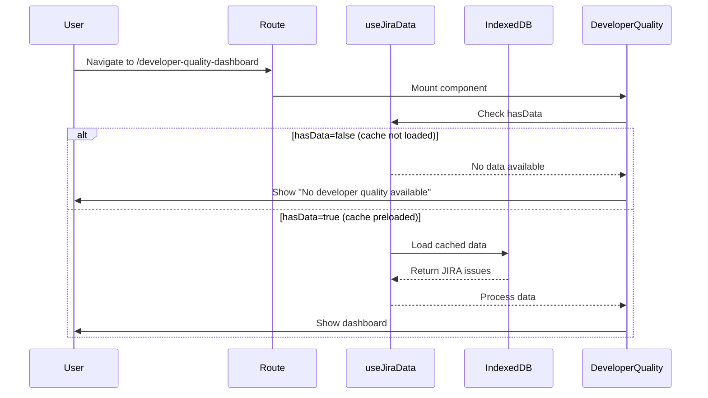

# JIRA Cache Initialization Issue Analysis

## Problem Statement

The application has an issue with caching where routes/components don't properly wait for JIRA data to be processed before showing "No developer quality available" error. This causes inconsistent behavior between different dashboard routes.

## Key Findings

### 1. Cache Architecture Overview

**JIRA Data Flow:**
```
S3 Downloads → jira_data_cache (IndexedDB) → useJiraData → Component-specific processing
```

**Storage Layers:**
- **Primary Storage**: IndexedDB (`jira_data_cache`) - stores raw JIRA issues
- **Component Cache**: Developer Quality Dashboard has its own processed data cache
- **Persistence**: Zustand persist middleware for UI state

### 2. Root Cause Analysis

#### Problem: Developer Quality Dashboard Shows "No developer quality available"

**Location**: `src/features/developer-quality-dashboard/components/DeveloperQualityDashboard/DeveloperQualityDashboard.jsx:216`

**Trigger Condition**: 
```javascript
if (needsInitialization || !filteredData) {
  // Shows "No developer quality available" message
}
```

**Why This Happens:**
1. **Timing Issue**: The dashboard loads before JIRA data is loaded from IndexedDB
2. **Missing Dependency Chain**: Developer Quality Dashboard relies on processed data that depends on raw JIRA data
3. **Initialization Logic Gap**: `needsInitialization` is true when no processed data exists, even if raw JIRA data is cached

#### Why Main Dashboard Works Correctly

**Main Dashboard Flow** (`src/features/dashboard/components/MainDashboard/MainDashboard.js:60-66`):
```javascript
useEffect(() => {
  if (!hasData && !isLoading && !error) {
    // Explicitly loads cached data on mount
    loadCachedData()
  }
}, [])
```

**Developer Quality Dashboard Flow** (`src/features/developer-quality-dashboard/hooks/useDeveloperQualityCache.js:50-92`):
```javascript
useEffect(() => {
  if (isLoading || data || error) return
  if (jiraLoading) return
  
  // Only loads JIRA data if it's already in memory
  if (jiraData && Array.isArray(jiraData) && jiraData.length > 0) {
    loadData(jiraData)
    return
  }
  
  // Conditional cache loading - only if hasData is true
  if (!jiraData && hasData) {
    loadCachedData()
    return
  }
})
```

### 3. Detailed Component Comparison

| Aspect | Main Dashboard | Developer Quality Dashboard |
|--------|---------------|---------------------------|
| **Cache Loading** | Explicit `loadCachedData()` on mount | Conditional based on `hasData` flag |
| **Data Processing** | Immediate processing when JIRA data available | Waits for JIRA data to be loaded AND processed |
| **Error Handling** | Shows friendly "Load from Cache" message | Shows "No developer quality available" |
| **Initialization** | Proactive cache loading | Reactive to data availability |

### 4. Cache Dependencies Analysis

#### JIRA Data Store (`src/features/jira-data/store/jiraDataStore.js`)
- **Cache Key**: `jira_data_cache`
- **Auto-loads**: On mount if `allIssues.length === 0`
- **Storage**: IndexedDB via `hybridCacheService`

#### Developer Quality Store (`src/features/developer-quality-dashboard/store/developerQualityStore.js`)
- **Depends On**: Raw JIRA data from `useJiraData`
- **Processing**: `developerQualityService.processJiraIssuesForDeveloperQuality()`
- **Cache**: Separate processed data cache

#### useJiraData Hook (`src/features/jira-data/hooks/useJiraData.js:32-41`)
```javascript
useEffect(() => {
  if (allIssues.length === 0 && !isLoading && !error) {
    loadFromCache()
  }
}, [allIssues.length, isLoading, error])
```

### 5. The "Funny Story" Explained

> "When travel to 'main-dashboard' route, the error not happened anymore"

**Explanation:**
1. **Main Dashboard** proactively loads cached JIRA data on mount
2. This populates the global JIRA data store (`allIssues`)
3. **Developer Quality Dashboard** then finds JIRA data already loaded
4. No "No developer quality available" error appears

**Route Order Impact:**
- **main-dashboard → developer-quality-dashboard**: ✅ Works (JIRA data preloaded)
- **developer-quality-dashboard directly**: ❌ Fails (no preloaded data)

## Technical Details

### Cache Flow Timing



### Key Files and Locations

#### Cache Logic:
- **jira_data_cache**: `src/features/jira-data/services/indexedDBCache.js:4` (DB_NAME)
- **S3 Download**: `src/features/jira-data/services/s3DownloadService.js`
- **Cache Service**: `src/features/jira-data/services/cacheService.js`

#### Initialization Logic:
- **useJiraData**: `src/features/jira-data/hooks/useJiraData.js:32-41`
- **useDeveloperQualityCache**: `src/features/developer-quality-dashboard/hooks/useDeveloperQualityCache.js:151-154`
- **Main Dashboard Mount**: `src/features/dashboard/components/MainDashboard/MainDashboard.js:60-66`

#### Error Display:
- **Error Message**: `src/features/developer-quality-dashboard/components/DeveloperQualityDashboard/DeveloperQualityDashboard.jsx:216`

## Recommended Solutions

### 1. Immediate Fix (Low Risk)
**Modify Developer Quality Dashboard to proactively load cache on mount**

```javascript
// In useDeveloperQualityCache.js
useEffect(() => {
  if (!hasData && !isLoading && !error && !jiraLoading) {
    // Proactively load cached data like Main Dashboard does
    loadCachedData()
  }
}, []) // Run only on mount
```

### 2. Comprehensive Fix (Medium Risk)
**Centralize cache initialization at the app level**

- Move cache loading to `App.js` or a global data provider
- Ensure all routes wait for initial cache load before rendering
- Add global loading state during cache initialization

### 3. Future-Proof Fix (High Risk)
**Implement centralized data architecture**

- Single source of truth for JIRA data
- Observer pattern for data dependencies
- Unified caching strategy across all components

## Impact Assessment

### Current Issue Impact:
- **User Experience**: Confusing "no data" messages on direct navigation
- **Functionality**: Requires specific navigation order to work properly
- **Development**: Inconsistent behavior between components

### Business Impact:
- **Low**: Workaround exists (navigate to main-dashboard first)
- **Medium**: Reduces confidence in application reliability
- **High**: May cause users to think data is missing when it's cached

## Testing Strategy

1. **Direct Navigation Test**: Access `/developer-quality-dashboard` directly
2. **Cache State Test**: Verify data loads from IndexedDB on fresh page load
3. **Route Order Test**: Confirm main-dashboard → developer-quality-dashboard works
4. **Clear Cache Test**: Verify behavior when no cached data exists

---

**Analysis Date**: 2025-01-26  
**Components Analyzed**: Main Dashboard, Developer Quality Dashboard, JIRA Data Store  
**Cache System**: IndexedDB (jira_data_cache) + Zustand persistence