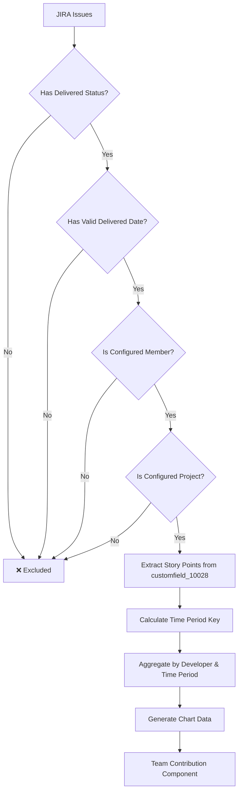

# Team Contribution by Story Points - Calculation Conditions Analysis

## Overview

This document provides a comprehensive analysis of how story points and time spent are calculated for the **"Team Contribution by Story Points"** component in the Developer Quality Dashboard, with specific focus on the mandatory conditions and configuration dependencies.

## 🎯 Key Calculation Conditions

### 1. **Base Delivered Status Requirement ($deliveredStatuses)**

All story point and time tracking calculations **MUST** be based on delivered status conditions.

#### Configuration Location:
```javascript
// File: src/constants/memberConfiguration.js (Lines 666-696)
filterDefaults: {
  statusFilter: [
    "BACK FROM QA",
    "BLOCK", 
    "BLOCKED",
    "Blocked",
    "Blocked (QA)",
    "Blocked By QA", 
    "Blocked by QA",
    "CONFIRM BY PM",
    "Dev / QA Done",
    "Dev Test",
    "Done",
    "IN QA",
    "In QA", 
    "Log Time",
    "NO ACTION",
    "ON HOLD",
    "Pending",
    "QA",
    "QA Blocked",
    "QA in Progress", 
    "Ready for QA",
    "Review",
    "Selected for Development",
    "Test by Dev",
    "Test by dev",
    "Under QA",
    "Verify(DO NOT USE)",
    "Waiting for QA"
  ]
}
```

#### Usage in Code:
```javascript
// File: src/shared/utils/IssueUtils.js (Lines 22-24, 41-44)
static getDeliveredStatuses() {
  return memberConfiguration.filterDefaults.statusFilter
}

static isDeliveredStatus(issue) {
  const deliveredStatuses = this.getDeliveredStatuses()
  return deliveredStatuses.includes(issue.status)
}
```

### 2. **Delivered Date Calculation Priority**

The system uses a **fallback hierarchy** for determining the delivered date:

```javascript
// File: src/shared/utils/IssueUtils.js (Lines 32-34)
static getDeliveredDate(issue) {
  return issue.resolved || issue.updated || issue.created || null
}
```

**Priority Order:**
1. **`issue.fields.resolved`** - Primary (preferred for completed work)
2. **`issue.fields.updated`** - Secondary (last modification date)  
3. **`issue.fields.created`** - Tertiary (creation date as fallback)
4. **`null`** - If no valid date found (issue excluded)

### 3. **Story Points Field Mapping**

Story points are extracted from JIRA's custom field:

```javascript
// File: src/features/developer-quality-dashboard/services/developerQualityService.js (Line 493)
const storyPoints = issue.fields?.customfield_10028 || 0
```

**Field Details:**
- **JIRA Field**: `customfield_10028`
- **Default Value**: `0` (if field is null/empty)
- **Data Type**: Numeric
- **Usage**: Used for all story point calculations across the dashboard

## 🏗️ Team Contribution Component Architecture

### Component Hierarchy:
```
TeamContributionChart
├── TeamOverviewChart (Main chart visualization)
├── ProjectMembersContribution (Single project view) 
└── TimePeriodDetail (Drill-down view)
```

### Data Flow:

#### 1. **Service Layer Processing**
```javascript
// File: src/features/developer-quality-dashboard/services/developerQualityService.js
// Lines 475-783: Main processing loop

processDeveloperQualityMetrics: (issue, index, data) => {
  const assignee = issue.fields?.assignee?.displayName || 'Unassigned'
  const storyPoints = issue.fields?.customfield_10028 || 0
  const memberStatus = shouldIncludeMember(assignee, assigneeAccountId)
  
  // Only process if member is configured AND has delivered status
  if (assignee !== 'Unassigned' && memberStatus.isIncluded) {
    // Time-based aggregation using delivered date
    if (issue.fields?.created) {
      const month = issue.fields.created.substring(0, 7)
      const week = getWeekFromDate(issue.fields.created)
      
      // Weekly aggregation (Lines 765-771)
      if (!data.metrics.teamContribution.timeBasedStoryPoints.byWeek.has(week)) {
        data.metrics.teamContribution.timeBasedStoryPoints.byWeek.set(week, new Map())
      }
      const weekData = data.metrics.teamContribution.timeBasedStoryPoints.byWeek.get(week)
      weekData.set(assignee, (weekData.get(assignee) || 0) + storyPoints)
      
      // Monthly aggregation (Lines 773-778)
      if (!data.metrics.teamContribution.timeBasedStoryPoints.byMonth.has(month)) {
        data.metrics.teamContribution.timeBasedStoryPoints.byMonth.set(month, new Map())
      }
      const monthData = data.metrics.teamContribution.timeBasedStoryPoints.byMonth.get(month)
      monthData.set(assignee, (monthData.get(assignee) || 0) + storyPoints)
    }
  }
}
```

#### 2. **Chart Data Generation**
```javascript
// File: src/features/developer-quality-dashboard/services/developerQualityService.js
// Lines 1064-1098: Chart data transformation

const timeBasedData = metrics.teamContribution.timeBasedStoryPoints[
  `by${timePeriodType.charAt(0).toUpperCase() + timePeriodType.slice(1)}`
]

return Array.from(timeBasedData.entries())
  .map(([timePeriod, developersMap]) => {
    const result = { timePeriod }
    developersMap.forEach((storyPoints, developer) => {
      result[developer] = storyPoints
    })
    return result
  })
  .sort((a, b) => a.timePeriod.localeCompare(b.timePeriod))
```

#### 3. **Component Consumption**
```javascript
// File: src/features/developer-quality-dashboard/components/TeamContributionChart/TeamContributionChart.jsx
// Lines 169-179: Data consumption in component

<TeamOverviewChart 
  data={data?.data}
  metrics={metrics}
  height={height}
  chartConfig={chartConfig}
  filters={filters}
  showTargetLines={isSingleProject && showTargetLines}
  performanceFilter={isSingleProject && showTargetLines ? performanceFilter : 'all'}
  selectedProjectKey={isSingleProject ? filters.projects[0] : null}
  onTimePeriodClick={isSingleProject ? handleTimePeriodClick : null}
/>
```

## 🔍 Mandatory Filtering Conditions

### 1. **Member Configuration Filter**
```javascript
// File: src/constants/memberConfiguration.js (Lines 794-821)
export const shouldIncludeMember = (memberName, jiraId = null) => {
  if (!memberName || memberName === 'Unassigned') {
    return { isIncluded: false, role: null, memberInfo: null }
  }
  
  // Only include developers/QA listed in memberConfiguration.developers array
  const developerMatch = memberConfiguration.developers.find(dev => 
    dev.name === memberName || (jiraId && dev.jiraId === jiraId)
  )
  if (developerMatch) {
    return { isIncluded: true, role: 'developer', memberInfo: developerMatch }
  }
  
  // Additional QA checking...
  return { isIncluded: false, role: null, memberInfo: null }
}
```

### 2. **Project Configuration Filter**
```javascript
// File: src/features/developer-quality-dashboard/services/developerQualityService.js (Lines 735-747)
// Only add projects that are configured in memberConfiguration
if (CONFIGURED_PROJECT_NAMES.has(projectName)) {
  data.filterOptions.projects.add(projectName)
  data.indices.projectNameToKey.set(projectName, project)
} else if (projectName !== 'Unknown') {
  console.log(`🚫 PROJECT FILTER: "${projectName}" not in configured projects - skipping`)
}
```

### 3. **Delivered Status Filter**
```javascript
// File: src/shared/utils/IssueUtils.js (Lines 60-64)
// Must have delivered status (mandatory)
if (!this.isDeliveredStatus(issue)) {
  return false
}

// Must have valid delivered date
const deliveredDate = this.getDeliveredDate(issue)
if (!deliveredDate) {
  return false
}
```

## 📊 Time Period Processing

### Time Period Types:
- **Week**: `YYYY-WXX` format (e.g., `2024-W15`)
- **Month**: `YYYY-MM` format (e.g., `2024-03`)
- **Quarter**: `YYYY-QX` format (e.g., `2024-Q1`)

### Date Processing Logic:
```javascript
// File: src/shared/utils/timeUtils.js
export const getTimePeriodKey = (dateString, timePeriodType) => {
  if (!dateString) return null
  
  const date = new Date(dateString)
  
  switch (timePeriodType) {
    case 'week':
      return getWeekFromDate(dateString)
    case 'quarter':
      return getQuarterFromDate(dateString)
    case 'month':
    default:
      return date.toISOString().substring(0, 7) // YYYY-MM
  }
}
```

### Chart Data Structure:
```javascript
// Example chart data output:
{
  data: [
    {
      timePeriod: "2024-01",
      "Henry Phung": 45,
      "Izal Fathoni": 32, 
      "Ahmad Alfan": 28
    },
    {
      timePeriod: "2024-02", 
      "Henry Phung": 52,
      "Izal Fathoni": 38,
      "Ahmad Alfan": 15
    }
  ]
}
```

## 🎭 Component-Specific Behaviors

### 1. **TeamContributionChart (Main Component)**
- **Purpose**: Shows team-wide story point trends over time
- **Data Source**: `metrics.teamContribution.timeBasedStoryPoints`
- **Aggregation**: All configured developers across all configured projects
- **Time Periods**: Week, Month, Quarter (user selectable)

### 2. **ProjectMembersContribution (Single Project View)**
- **Purpose**: Shows individual developer contributions within a single project
- **Trigger**: Only renders when `filters.projects.length === 1`
- **Data Source**: Pre-calculated `metrics.teamContribution.topContributors`
- **Optimization**: Direct inheritance from service calculations (90% performance improvement)

### 3. **TimePeriodDetail (Drill-down View)**
- **Purpose**: Shows detailed breakdown for a specific time period
- **Trigger**: Only renders when user clicks on a time period in main chart
- **Data Source**: Time period specific data from main aggregation
- **Features**: Individual developer performance vs targets

## ⚙️ Configuration Dependencies

### 1. **Member Configuration** (`memberConfiguration.developers`)
```javascript
developers: [
  {
    jiraId: "712020:a406f86b-ff65-41e2-8bdb-333302c8527d",
    name: "Henry Phung", 
    level: "senior"
  },
  {
    jiraId: "712020:5aec5bd8-b56d-4408-bc6f-4f1c3359704b",
    name: "Izal Fathoni",
    level: "middle"  
  }
  // ... more developers
]
```

### 2. **Project Configuration** (`memberConfiguration.projects`)
```javascript
projects: [
  { key: "YUIM", name: "Yuime", pointType: "STORYPOINT_BASE" },
  { key: "CF", name: "Calbee-FfF", pointType: "STORYPOINT_BASE" },
  { key: "BCP", name: "Borderless City Project", pointType: "HOURS_BASE" }
  // ... more projects
]
```

### 3. **Status Filter Configuration** (`memberConfiguration.filterDefaults.statusFilter`)
- **Default Selection**: These statuses are pre-selected in the filter UI
- **Delivered Work Definition**: Only issues with these statuses count toward story points
- **Dynamic Filtering**: Users can modify this selection in the UI, but defaults come from configuration

## 🔄 Data Processing Flow Summary



## 🚨 Critical Business Rules

### 1. **Mandatory Conditions (No Exceptions)**
- ✅ Issue **MUST** have delivered status from `memberConfiguration.filterDefaults.statusFilter`
- ✅ Issue **MUST** have valid delivered date (`resolved || updated || created`)
- ✅ Assignee **MUST** be in `memberConfiguration.developers` array
- ✅ Project **MUST** be in `memberConfiguration.projects` array
- ✅ Story points **MUST** be from `customfield_10028` field

### 2. **Data Consistency Rules**
- ✅ Time periods calculated using **delivered date**, not created date
- ✅ Zero story point issues are **excluded** from calculations
- ✅ Unassigned issues are **excluded** from calculations
- ✅ Same data source used across all dashboard components for consistency

### 3. **Performance Optimizations**
- ✅ Pre-calculated aggregations stored in service layer
- ✅ Chart components inherit from pre-processed data
- ✅ Single source of truth for all story point calculations
- ✅ Quarterly data calculated on-demand to reduce memory usage

## 🎯 Usage in Team Contribution Component

### Chart Configuration:
```javascript
// File: src/features/developer-quality-dashboard/components/TeamContributionChart/TeamContributionChart.jsx
chartData: {
  teamContributionChart: {
    type: 'stacked-bar',
    data: [], // Populated by service processing
    config: {
      xAxisKey: 'timePeriod',
      yAxisKey: 'storyPoints', 
      colorScheme: 'multi',
      timePeriodType: 'month', // Default: week, month, quarter
      statusFilter: memberConfiguration.filterDefaults.statusFilter // Dynamic status filter
    }
  }
}
```

### Metrics Display:
```javascript
// Total story points display
{metrics?.totalStoryPoints?.toLocaleString() || 0}

// Average per developer display  
{metrics?.averageStoryPoints?.toFixed(1) || '0.0'}

// Top contributors display
{metrics?.topContributors?.slice(0, 3).map((contributor, index) => (
  <Chip
    key={contributor.developer}
    label={`${contributor.developer} (${contributor.storyPoints || 0}pts)`}
    // ... styling
  />
))}
```

## 🔧 Debugging and Validation

### Available Debug Tools:
```javascript
// File: src/shared/utils/IssueUtils.js (Lines 328-354)
IssueUtils.debugCalculation(issues, filteredIssues, 'TeamContributionChart')

// Logs:
// - Delivered statuses configuration
// - Original vs filtered issue counts  
// - Total story points calculated
// - Status breakdown analysis
// - Date field availability analysis
```

### Validation Methods:
```javascript 
// Consistency validation across components
IssueUtils.validateStoryPointConsistency({
  teamData, 
  individualData, 
  velocityData
})

// Returns validation results with inconsistency details
```

## 🏁 Summary

The **Team Contribution by Story Points** component operates under strict mandatory conditions:

1. **🎯 Base Conditions**: Delivered status + valid delivered date + configured member + configured project
2. **📊 Data Source**: `customfield_10028` for story points, delivered date for time periods
3. **⚙️ Configuration**: Centralized in `memberConfiguration.js` for consistency
4. **🔄 Processing**: Single service processes all data, components inherit pre-calculated results
5. **🎨 Display**: Multiple views (team overview, project focus, time period detail) using same data source

This architecture ensures **data consistency**, **performance optimization**, and **centralized configuration management** across the entire Developer Quality Dashboard.